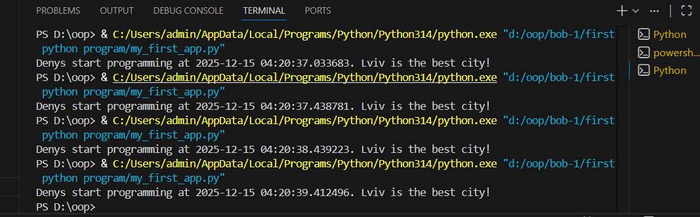
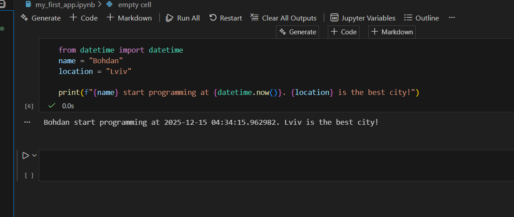

## Тема: Вступні заняття: налаштування середовища, прочаток роботи з Python та Markdown;
## Мета: Налаштувати середовище роботи VS Code, створити репозиторій Github та налаштувати інтеграцію з ним, написати першу програму на Python та створити звіт з використанням форматування Markdown;

Висновок

Під час виконання цієї роботи було успішно налаштовано середовище розробки Visual Studio Code та інтегровано його з сервісом GitHub, що дозволяє ефективно керувати версіями проєктів. Також було здійснено початок роботи з мовою програмування Python

